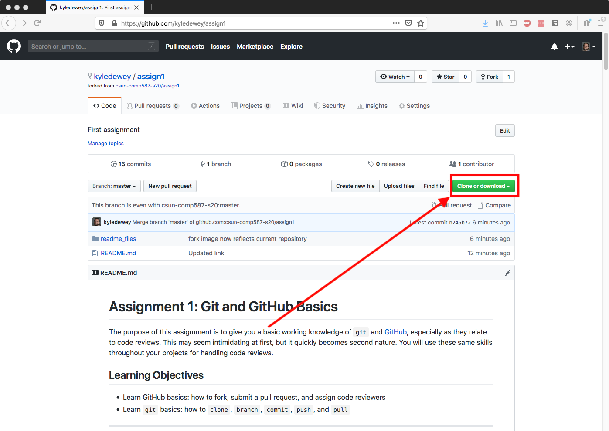

# Assignment 1: Git and GitHub Basics #

The purpose of this assigmment is to give you a basic working knowledge of `git` and [GitHub](https://github.com/), especially as they relate to code reviews.
This may seem intimidating at first, but it quickly becomes second nature.
You will use these same skills throughout your projects for handling code reviews.

## Learning Objectives ##

- Learn GitHub basics: how to fork, submit a pull request, and assign code reviewers
- Learn `git` basics: how to `clone`, `branch`, `commit`, `push`, and `pull`

-----------

## Step-by-Step Instructions ##

### Step 0: Create a GitHub Account ###

If you do not already have a [GitHub](https://github.com/) account, create one now.
This should only take a couple minutes, and it's free.
If you already have an account, you can use your existing account.

### Step 1: Fork this Repository ###

Go to the [main repository webpage](https://github.com/CSUN-COMP587-F18/assign1) for this repository.
[Fork](https://guides.github.com/activities/forking/) this repository over to **your own account**, using the button circled below:


A fork is effectively a copy of the entire repository, frozen at the point when you created the fork.
You own this copy and have complete control over it.
Notably, if the original repository changes, your fork will **not** automatically change; you created the copy from a specific point in time.
We'll come back to this in a bit.

### Step 2: Clone your Fork ###

> The remainder of these steps assume you're using the `git` command on the command-line.
> On Linux, this should be available through your package manager if it isn't already installed.
> On Mac, `git` is bundled with the normal developer tools, and on recent versions merely typing `git` will prompt you to install the developer tools.
> On Windows, these commands can be downloaded [here](https://git-scm.com/downloads).
> There are also a number of GUI tools out there for handling `git`.
> You may use whatever you want.

Go to your main GitHub page (should be `github.com/your_username`), and click the `Repositories` tab.
Your fork should be listed here.
Click on your fork, and then click the `Clone or download` button, circled below:


Clicking this button will display a URL, which will be something like `git@github.com:your_username/assign1.git`.
Have this URL handy somewhere (or even better, copy it to the clipboard).

On your local machine, go to a directory that makes sense to you for this assignment.
This will probably be a directory named `comp587`, or something like that.
In that directory, issue the following command:

```console
git clone URL
```

...where `URL` is the URL above.
This will download all the files in your fork to the local `assign1` directory, underneath whatever directory you're in.
(The `assign1` directory will be created automatically.)

Don't make any changes just yet; there is still some setup we need to do.

### Step 3: Setup your Fork to Sync with the Original ###

At the end of the first step, it was established that your fork is a **copy** of the original repository, frozen in a certain point in time.
While this has its uses, it's a little annoying, because we often want to be in sync with the original repository.

To keep things in sync, we will take advantage of a `git` feature known as [remotes](https://git-scm.com/book/en/v2/Git-Basics-Working-with-Remotes).
For our purposes, a _remote_ is a glorified URL pointing to a remotely-accessible `git` repository somewhere.
If you type the following command:

```console
git remote -v
```

...you'll see all the remotes that you already have setup.
This should give you output like the following:

```
origin	git@github.com:your_username/assign1.git (fetch)
origin	git@github.com:your_username/assign1.git (push)
```

The above information states that you have one remote named `origin`, from which you can both download (`fetch`) and upload (`push`) files.
By convention, `origin` is wherever the "home" of this repository is, which corresponds to your particular fork.

To keep things in sync with the original repository, we'll add the original repository as a remote.
First, get the `Clone or download` URL from the **original** repository, using the same process as in Step 2.
Then, run the following command:

```console
git remote add upstream URL
```

...where `URL` is the URL from the original repository.
This command states to add a new remote named `upstream`, which points to `URL`.
By convention, `upstream` points to the source we forked from.
You can confirm that this command worked by running `git remote -v` again.

Note that this step only establishes where to sync from; it doesn't actually perform the syncing.
Moreover, this syncing is not done automatically, nor would you generally want it to be automatic.
We won't get into how to sync in this assignment, but see [these instructions](https://help.github.com/articles/syncing-a-fork/) if you're curious.
It's good practice to establish the `upstream` immediately, even if you aren't going to use it immediately, and I want you to get in the habit of doing this.

### Step 4: Create a New Local Branch ###
