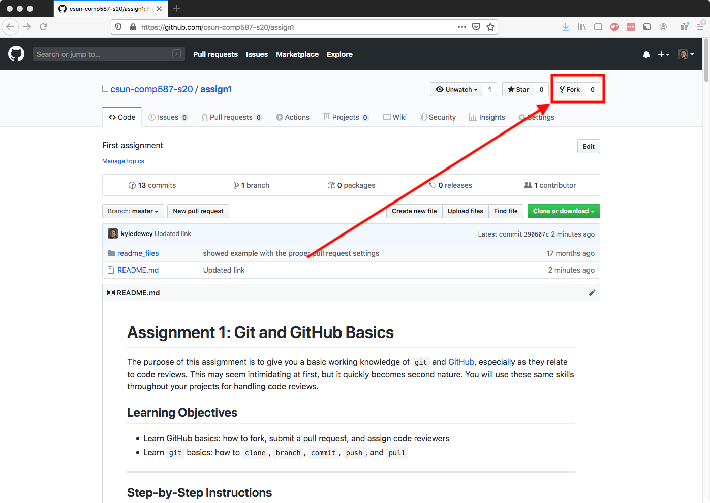

# Assignment 1: Git and GitHub Basics #

The purpose of this assigmment is to give you a basic working knowledge of `git` and [GitHub](https://github.com/), especially as they relate to code reviews.
This may seem intimidating at first, but it quickly becomes second nature.
You will use these same skills throughout your projects for handling code reviews.

## Learning Objectives ##

- Learn GitHub basics: how to fork, submit a pull request, and assign code reviewers
- Learn `git` basics: how to `clone`, `branch`, `commit`, `push`, and `pull`

-----------

## Step-by-Step Instructions ##

### Step 0: Create a GitHub Account ###

If you do not already have a [GitHub](https://github.com/) account, create one now.
This should only take a couple minutes, and it's free.
If you already have an account, you can use your existing account.

### Step 1: Fork this Repository ###

Go to the [main repository webpage](https://github.com/CSUN-COMP587-F18/assign1) for this repository.
[Fork](https://guides.github.com/activities/forking/) this repository over to **your own account**, using the button circled below:

A fork is effectively a copy of the entire repository, frozen at the point when you created the fork.
You own this copy and have complete control over it.
Notably, if the original repository changes, your fork will **not** automatically change; you created the copy from a specific point in time.

